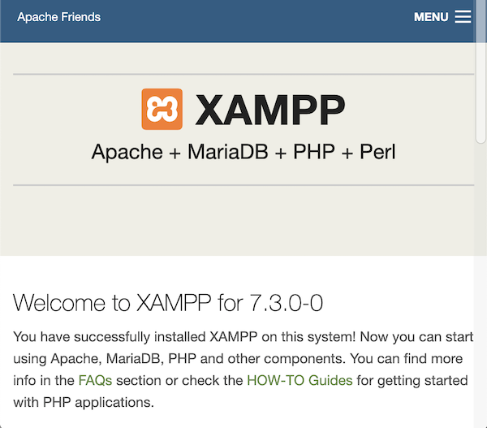

# html5-game-using-phaser
Making HTML5 Games with Phaser 3 (使用Phaser 3來撰寫HTML5遊戲)

## Required Tools

- IDE (Integrated Development Enviornment)
  - [Sublime Text](https://www.sublimetext.com/).
  - [Visual Studio Code](https://code.visualstudio.com/)

- [XAMPP](https://www.apachefriends.org/index.html), an Apache distribution which contains MySQL, PHP and Perl, is installed for phaser 3 development.
- [Phaser](https://www.sublimetext.com/) Framework, using the Phaser 3.
  - Snippet, using the phaser snippets from [phasergames.com](phasergames.com)
- Materias, using the artwork from [openGameArt.org](openGameArt.org)

## Develop & Deploy

### Install XAMPP

Follow the below steps to complete the deployment:

* Launch the XAMPP installer. Open the welcome screen and click **Next**.
* Select components you want to install. It is recommended to check every component. Click **Next**. 
* Select the installation directory to install. It is also recommended to use the default path. Click **Next**.
* Uncheck the **Learn more about Bitnami for XAMPP** option. We don't need it and lick **Next** to continue.
* Keep waiting for the last step. Do not forget to open the control panel after installation.

### Deploy XAMPP

Open the control panel as below illustration (on MAC):

Click **Start** to launch all services including Apache. Open the page by entering the IP address on the browser.

Click **Start** to launch all services including Apache. Open the page by entering the IP address on the browser.

## Set Up Game Folder Directory

On Mac, the default xampp folder is **/opt/lampp**. Mount the default folder by opening the control panel and switch to the **Volumes** tab. Click **Explore** button to open the Finder. 

Create the folder named **games**, and create **basicTemplate** folder under the **games**. Create the **js** and **images** folders to place the javascript files and images. 

Browse the page by accessing the http://ip_address/games.(**ip_address** is the IP address of the hosted computer, refer to **Deploy XAMPP** section. ) If works, the page will display. The folders has been created for the later phaser development.

